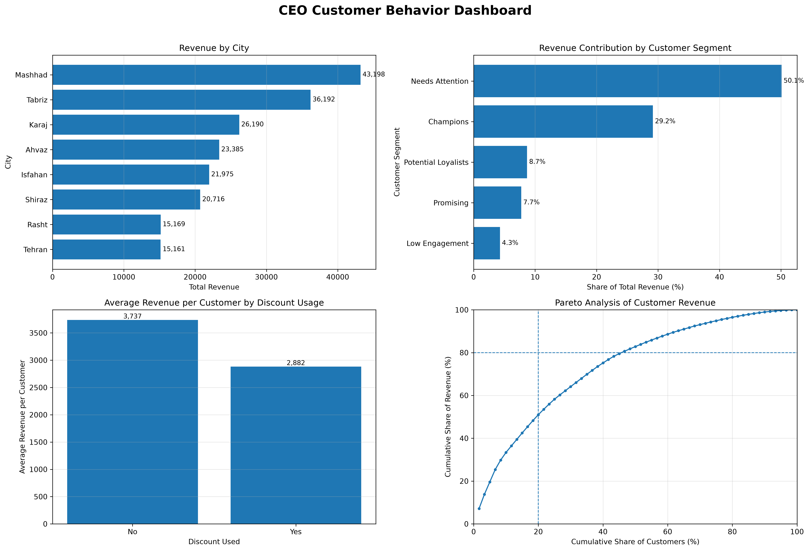

# Project 02 – Customer Behavior Analysis

## The First Day as a Junior Data Analyst

This project analyzes customer behavior for an e-commerce company using the cleaned customer dataset prepared in Project 01.

The main objective is to transform customer-level data into actionable business insights that can help the CEO make better decisions regarding marketing, customer retention, loyalty programs, discount strategy, customer segmentation, and revenue concentration.

====================

## Business Questions

The analysis addresses the following business questions:

1. What is the overall business performance based on key customer KPIs?
2. Which city should be prioritized for the next marketing campaign?
3. Who are the 10 most valuable customers for a loyalty campaign?
4. Which customers show signs of inactivity or retention risk?
5. How do customers who used discounts differ from those who did not?
6. How can customers be segmented into meaningful behavioral groups?
7. Is revenue concentrated among a relatively small percentage of customers?
8. What information should be included in a CEO-level dashboard?
9. What business recommendations are supported by the analysis?
10. What limitations should be considered when interpreting the results?

====================

## Dataset

The analysis uses the cleaned customer dataset produced in Project 01.

The final dataset contains:

- **60 unique customers**
- **17 variables**
- **0 missing values**
- **0 duplicate customer IDs**
- **0 duplicate rows**

Each row represents one customer rather than an individual transaction. Therefore, variables such as `purchase_count`, `avg_order_value`, and `total_spending` represent customer-level aggregated information.

====================

## Key Business KPIs

| KPI | Value |
|---|---:|
| Total Customers | 60 |
| Total Revenue | 201,985.73 |
| Total Purchases | 1,043 |
| Revenue per Customer | 3,366.43 |
| Overall Average Order Value | 193.66 |
| Average Satisfaction Score | 2.98 / 5 |

These indicators provide a high-level view of the size, purchasing activity, customer value, and satisfaction level of the analyzed customer base.

====================

## Key Findings

### 1. Geographic Performance

**Mashhad** is recommended as the strongest candidate for the next city-level marketing campaign.

Mashhad represents **18.33% of all customers**, while generating:

- **21.39% of total revenue**
- **23.87% of total purchases**
- **3,927.05 average revenue per customer**

Its average revenue per customer is higher than the overall customer average of **3,366.43**.

Mashhad therefore provides a strong combination of customer base size, revenue contribution, and purchasing activity.

Although Isfahan has a higher average revenue per customer, its customer base in this dataset is considerably smaller. Tabriz has the largest number of customers, but its revenue contribution is lower relative to its customer share.

====================

### 2. Most Valuable Customers

The 10 customers with the highest `total_spending` were selected as the most valuable customers for a potential loyalty campaign.

These customers represent only **16.67% of the customer base**, but they generated:

- **45.39% of total revenue**
- **25.31% of total purchases**

Their average total spending is approximately **9,167.99**, compared with **3,366.43** for the overall customer base.

However, their average satisfaction score is only **2.60**, compared with **2.98** for all customers, and some high-value customers have also been inactive for long periods.

This indicates that customer value and customer loyalty should not be treated as the same concept. Some high-value customers may simultaneously require loyalty rewards and retention actions.

====================

### 3. Customers at Risk of Leaving

The dataset does not contain an explicit churn indicator. Therefore, purchase inactivity was used as a proxy for retention risk.

The 75th percentile of `last_purchase_days` was used as the inactivity threshold:

**273.75 days**

Customers with a value at or above this threshold were classified as at risk.

The results identified:

- **15 at-risk customers**
- **25.00% of the customer base**
- **38,757.75 historical revenue**
- **19.19% of total historical revenue**

The highest-value customers within this group should receive greater retention priority because their loss may have a larger financial impact.

Several high-priority inactive customers also have very low satisfaction scores, suggesting that retention efforts should consider customer experience in addition to purchase inactivity.

====================

### 4. Discount Usage Analysis

Customers were divided into two groups based on whether they had used discounts.

| Metric | No Discount | Discount Used |
|---|---:|---:|
| Customers | 34 | 26 |
| Total Revenue | 127,049.20 | 74,936.53 |
| Average Revenue per Customer | 3,736.74 | 2,882.17 |
| Average Purchases per Customer | 17.29 | 17.50 |
| Overall Average Order Value | 216.07 | 164.70 |
| Average Satisfaction | 2.76 | 3.27 |

Customers who did not use discounts generated higher average revenue per customer and a higher average order value.

At the same time, average purchase frequency was almost identical between the two groups.

These findings suggest that discount users were not financially more valuable in the current dataset. However, the analysis is observational and does **not** prove that discounts caused lower spending.

A controlled experiment or A/B test would be required to estimate the causal effect of discount campaigns.

====================

## Customer Segmentation

An RFM-inspired segmentation approach was used based on:

- **Recency:** `last_purchase_days`
- **Frequency:** `purchase_count`
- **Monetary Value:** `total_spending`

Each variable was divided into quartiles and assigned a score from 1 to 4.

Five actionable customer segments were then created.

| Segment | Customers | Customer Share | Revenue Share |
|---|---:|---:|---:|
| Needs Attention | 20 | 33.33% | 50.10% |
| Champions | 9 | 15.00% | 29.17% |
| Potential Loyalists | 8 | 13.33% | 8.70% |
| Promising | 13 | 21.67% | 7.75% |
| Low Engagement | 10 | 16.67% | 4.28% |

### Needs Attention

This segment contains **33.33% of customers** but historically generated **50.10% of total revenue**.

Their average time since the last purchase is approximately **269.30 days**.

This makes the group particularly important for retention and reactivation campaigns.

### Champions

Champions represent only **15.00% of customers**, but generate **29.17% of total revenue**.

They have the highest average revenue per customer and the highest average purchase count among the identified segments.

These customers should be protected through loyalty benefits, personalized communication, and recognition programs.

### Potential Loyalists

These customers are relatively active and already show strength in either purchase frequency or monetary value.

They represent an opportunity for increasing long-term customer value.

### Promising

These customers are relatively recent but currently have lower purchasing frequency and monetary value.

They may have future growth potential if appropriately developed.

### Low Engagement

This segment represents **16.67% of customers**, but contributes only **4.28% of total revenue**.

Because both customer value and engagement are relatively low, this group generally has a lower marketing priority than Champions or Needs Attention customers.

====================

## Pareto Analysis

Pareto analysis was performed to determine whether a small percentage of customers generates most of the company's revenue.

The results show that the classic **80/20 rule is not supported** by this dataset.

The top **20% of customers**, representing 12 customers, generate approximately:

**51.00% of total revenue**

To reach approximately **80% of total revenue**, the business requires:

**28 customers**

This represents:

**46.67% of the customer base**

Therefore, revenue is concentrated among higher-value customers, but the concentration is substantially weaker than the traditional 80/20 Pareto pattern.

====================

## Business Recommendations

### 1. Prioritize High-Value Customer Retention

The **Needs Attention** segment should receive the highest retention priority.

Although this group represents only one-third of the customer base, it historically generated more than half of total revenue.

Retention efforts should particularly target customers who combine:

- high historical spending,
- long purchase inactivity,
- and low satisfaction.

Personalized reactivation offers, service recovery, and loyalty incentives may be more effective for these customers than general mass-marketing campaigns.

### 2. Prioritize Mashhad for the Next Marketing Campaign

Mashhad currently provides the strongest combination of:

- customer base size,
- revenue contribution,
- purchasing activity,
- and customer value.

The city should therefore be considered a priority market for the next geographic campaign.

Because customer recency in Mashhad is not particularly strong, the campaign may also include reactivation objectives in addition to new sales generation.

### 3. Use More Targeted Discount Strategies

The current analysis does not show higher financial value among customers who used discounts.

Therefore, broad discounting should be reconsidered in favor of more targeted offers.

Discounts may be more strategically useful when applied to:

- high-value inactive customers,
- Potential Loyalists,
- specific retention campaigns,
- or clearly defined customer acquisition objectives.

The causal impact of discounts should ideally be evaluated through controlled experiments.

====================

## CEO Dashboard

The final CEO dashboard summarizes four major areas of the analysis:

- Revenue by City
- Revenue Contribution by Customer Segment
- Average Revenue per Customer by Discount Usage
- Pareto Analysis of Customer Revenue



====================

## Project Structure

```text
mojtabamaldar/
├── charts/
│   ├── ceo_dashboard.png
│   ├── discount_revenue_comparison.png
│   ├── pareto_analysis.png
│   ├── revenue_by_city.png
│   └── revenue_by_segment.png
├── data/
│   └── cleaned_dataset_mojtabamaldar.xlsx
├── project02_analysis.ipynb
└── README.md
```

====================

## Tools and Libraries

The project was completed using:

- Python
- pandas
- NumPy
- Matplotlib
- Jupyter Notebook
- Visual Studio Code

====================

## Dataset Limitations

Several limitations should be considered when interpreting the results.

### Small Sample Size

The dataset contains only 60 customers. This is appropriate for exploratory analysis but limits the generalizability of the findings.

### Aggregated Customer-Level Data

The dataset does not contain individual transactions. Therefore, transaction-level trends, seasonality, product preferences, and purchase timing cannot be analyzed directly.

### Undefined Observation Period

The exact period over which `purchase_count` and `total_spending` were accumulated is not specified.

Because customers have different signup dates, some customers may have had more time to accumulate purchases and spending.

### Revenue Is Not Profit

`total_spending` measures customer revenue contribution but does not include:

- product costs,
- gross margin,
- fulfillment costs,
- acquisition costs,
- or marketing costs.

Therefore, high revenue does not necessarily imply high profitability.

### No Confirmed Churn Variable

Customer retention risk is based on inactivity rather than confirmed churn.

The identified at-risk customers should therefore be interpreted as customers showing behavioral warning signs, not confirmed churned customers.

### Limited Discount Information

The dataset only indicates whether a discount was used.

It does not provide information about:

- discount amount,
- campaign type,
- discount frequency,
- timing,
- or customer eligibility.

Therefore, discount effectiveness cannot be evaluated causally.

### Data Definition Ambiguities

Some variables require clearer business definitions.

For example, one customer has zero purchases and zero total spending but still has a value for `last_purchase_days`.

The meaning of `returned_items` also depends on whether it represents returned orders, products, or individual units.

### Relative RFM Segmentation

The RFM scores are based on quartiles within this dataset.

Therefore, the resulting segment boundaries are relative to these 60 customers and may change when the dataset grows or customer behavior changes.

====================

## Conclusion

The analysis shows that customer value is not evenly distributed across the customer base.

High-value inactive customers represent an important retention opportunity, while Champions should be protected through loyalty programs.

Mashhad represents the strongest geographic opportunity for the next marketing campaign based on the current data.

The discount analysis also indicates that broad discounting should not automatically be assumed to create greater customer value.

Overall, the analysis demonstrates how customer-level data can support more focused decisions in marketing, retention, segmentation, and promotional strategy.

====================

## Author

**GitHub:** [mojtabamaldar](https://github.com/mojtabamaldar)